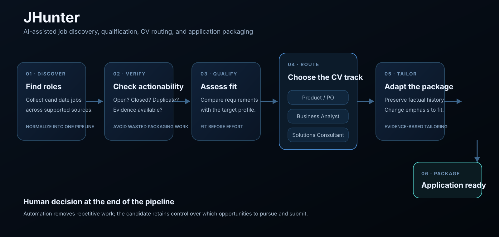

# JHunter — AI Job Search Agent

**Discover roles. Qualify fit. Route the right CV. Build the application package.**

> **Public product showcase.** JHunter is a privately developed job-search automation system. This repository presents the workflow, architecture, and product principles without exposing private source code, credentials, application data, or operational configuration.

## What is JHunter?

JHunter is an AI-assisted job-search workflow built to turn a high-volume search into a structured, repeatable pipeline.

Instead of manually opening roles, deciding whether each one is worth pursuing, choosing which CV to use, and rebuilding application material from scratch, JHunter coordinates those steps as one workflow:

**Discover → Verify → Qualify → Route → Tailor → Package**

The objective is not to replace judgment. It is to remove repetitive work so attention can stay on the opportunities that deserve it.

## The workflow

  

### 1. Discover

JHunter collects candidate roles from supported job sources and normalizes them into a common review pipeline.

The system is designed to work across different role families and to separate source availability from role suitability. A job can be relevant but unavailable, closed, duplicated, or unsupported — those states should not be confused.

### 2. Verify

Before spending effort on application material, JHunter checks whether the role is still actionable and preserves evidence from the job posting.

This helps avoid wasting time packaging applications for positions that are already closed or no longer accepting candidates.

### 3. Qualify

Each role is assessed against the target profile and the requirements visible in the posting.

The result is not just a generic keyword match. The system is designed to distinguish between different kinds of fit and route opportunities into the appropriate application path.

### 4. Route the right CV

JHunter maintains separate CV tracks for the main role families being targeted:

- **Product Owner / Product**
- **Business Analyst**
- **Solutions Consultant / Implementation**

The selected track becomes the base for the application package rather than forcing one generic CV across materially different roles.

### 5. Tailor

JHunter prepares role-specific application material using the evidence collected from the posting and the selected CV track.

The aim is controlled tailoring: preserve factual career history while changing emphasis, terminology, and supporting material to match the opportunity.

### 6. Package

The final output is an application-ready package rather than another analysis report.

Depending on the role, that can include:

- the selected CV;
- a tailored version of the CV;
- a role-specific cover letter;
- source evidence and qualification context;
- status information for the application workflow.

## Why build this?

Job search at scale is a workflow problem.

The repetitive cost is spread across many small decisions:

- Is the role actually open?
- Is it worth applying?
- Which professional angle fits best?
- Which CV should be used?
- What should be emphasized?
- What evidence from the posting matters?
- Has this opportunity already been processed?

JHunter turns those decisions into an explicit pipeline instead of rebuilding them manually for every vacancy.

## Product principles

| Principle | JHunter approach |
| --- | --- |
| **Evidence before tailoring** | Application material is grounded in the actual job posting. |
| **Fit before effort** | Qualification happens before expensive packaging work. |
| **Multiple professional narratives** | Different role families use different CV tracks rather than one generic profile. |
| **Preserve factual history** | Tailoring changes emphasis, not the underlying career record. |
| **Explicit workflow state** | Closed, unsupported, qualified, packaged, and other states remain distinguishable. |
| **Human agency** | Automation reduces repetitive work; final career decisions remain with the candidate. |

## What JHunter demonstrates

JHunter combines several kinds of product and engineering work in one applied system:

**Agentic workflow design**  
A multi-stage process coordinates discovery, verification, qualification, document selection, tailoring, and packaging.

**Evidence handling**  
Role decisions remain connected to the source material that produced them.

**Routing logic**  
Different opportunities can follow different CV and application paths.

**Document automation**  
Structured job evidence is turned into usable application artifacts.

**Operational state**  
The system tracks where each opportunity sits in the workflow instead of treating every run as stateless.

## Public / private boundary

The working JHunter implementation remains private.

This repository intentionally contains only:

- the product concept;
- selected screenshots or demonstrations;
- a high-level workflow diagram;
- engineering and product principles.

It intentionally does **not** publish:

- production source code;
- API credentials or tokens;
- personal application data;
- private CV content;
- target-company datasets;
- internal prompts;
- scraping or browser-automation internals;
- private configuration or deployment details.

## Status

JHunter is an actively developed working tool used to support a real job-search workflow.

This public repository exists to demonstrate the **product thinking, agentic orchestration, and automation design** behind the system without exposing the private implementation.

---

**JHunter**  
*AI-assisted job discovery, qualification, CV routing, and application packaging.*

**JD Vellino** · AI Automation Consultant · Agentic AI · Deterministic Workflows
